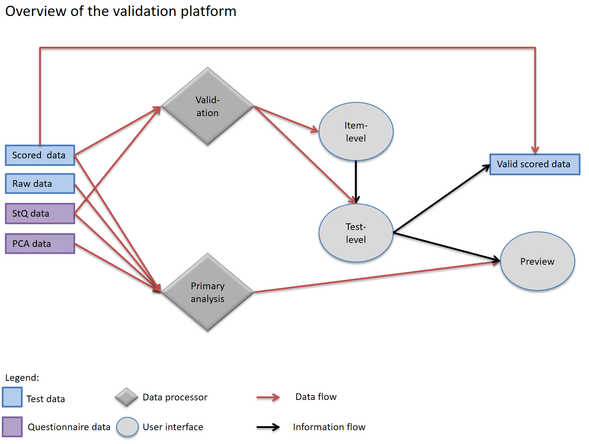

# PISA for Schools

**folder to pull/push files from**
https://BonaventuraFrancesco.PACILEO@algobank.oecd.org:4430/BonaventuraFrancesco.PACILEO/pisa-for-schools.git

**git cmd**
\\\em-sbx-fs-1\EM_Apps\PortableGit\git-cmd.exe

**description**

it should be enough to run the VS_shell.R in /src to get the results, provided that all the necessary R packages are installed (do not need to load them)

**information architecture**

