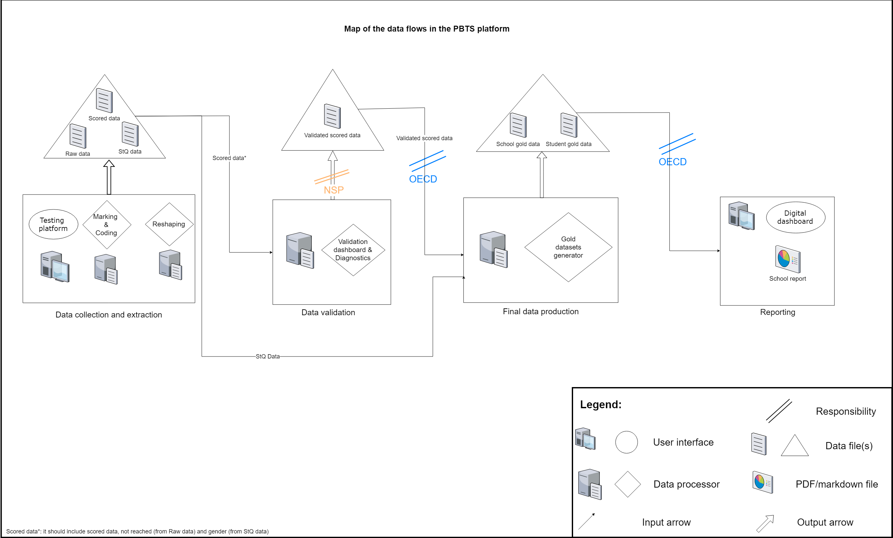

# PISA for Schools

**Purpose**

The main purpose of the validation study of the PISA-Based Test for Schools is to assess quality, 
reliability and comparability of the assessment instruments in the country of test. The validation study consists 
of items psychometric properties analyses in the language of the country of test and further international comparison of items characteristics. 
The decisions regarding item treatment for results generation and for future administrations the PBTS can also be made based on this report.

The shell file creates the interactive R dashboard that allows the user to analyse the results for the available countries.

**Setup**

The path to push/pull files from is 
https://BonaventuraFrancesco.PACILEO@algobank.oecd.org:4430/BonaventuraFrancesco.PACILEO/pisa-for-schools.git

The path to the git command line is 
\\\em-sbx-fs-1\EM_Apps\PortableGit\git-cmd.exe

**Description**

The *data* folder contains all the input data files organised by country.

The *images* folder contains all the output images of the analysis plus the data flows map.

The *data* folder contains all the input data files organised by country.

The *output* folder contains all the output files (Rmd plus exported ones).

The *src* folder contains all the script files (in R):

/src:
*  PBTS-VS_shell.R: shell file that sets the wd, loads the required packaged and execute all the other .R files;

/src/config:
*  PBTS-VS_analysisfuns.R: it defines the functions that are used to perform all the analysis;
*  PBTS-VS_tablefuns.R: it defines the functions that are used to create the input data frame files of the tables;
*  PBTS-VS_techfuns.R: it defines all the auxiliary functions, including loops of other functions, color palettes and mathematics functions;

/src/dashboard:
*  PBTS-VS_server.R: it defines the server object of the Shiny app;
*  PBTS-VS_ui.R: it defines the ui object of the Shiny app;
  

**Map of the data flows**

